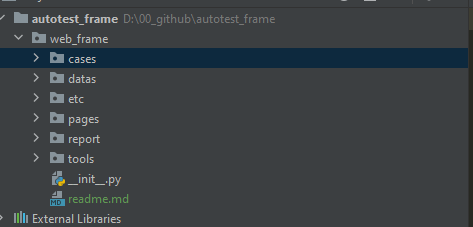
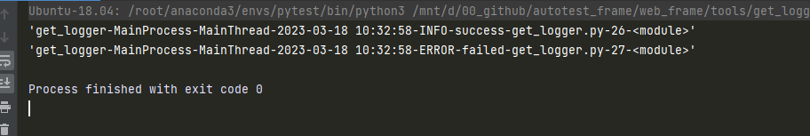
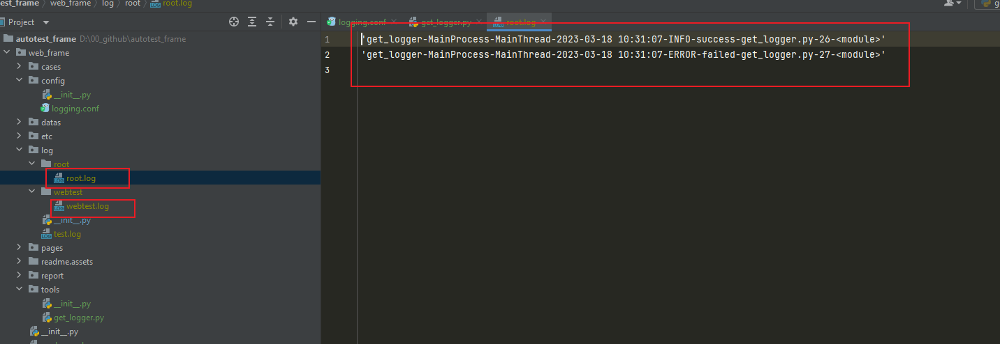
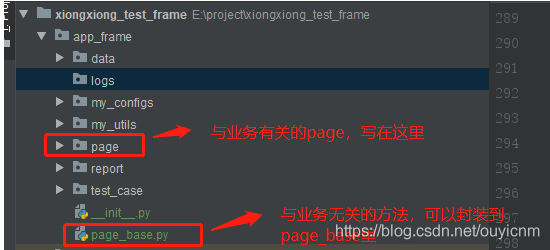
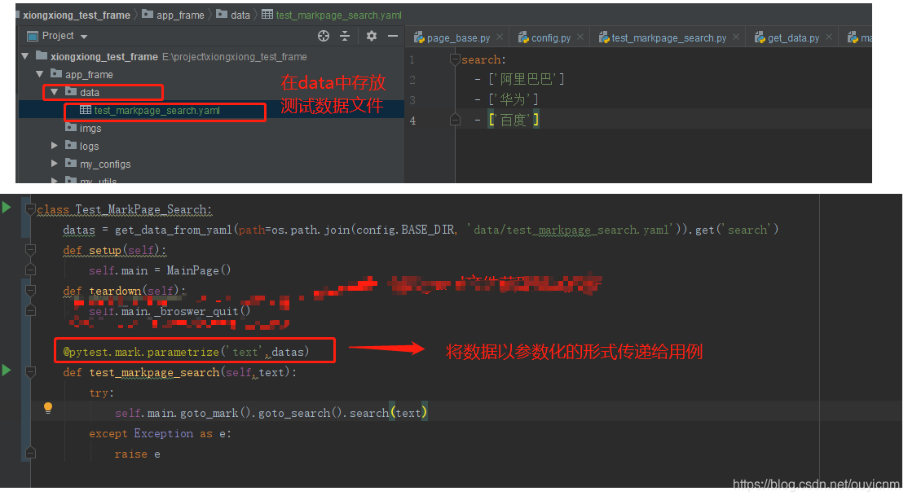
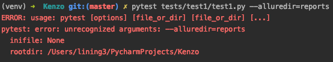

# 一.测试框架介绍

- 测试框架简单可以理解为一定的目录结构，这些目录结构分别实现了公共代码的封装，日志，用例的封装，测试报告等。
- 测试框架就是将公共方法，日志，测试报告，截图，数据驱动等独立封装出来。
- 测试框架的一个重要特性就是可移植性，即针对不同的业务项目，只需要单独写业务代码，其他模块都可以通用。

**测试框架讲解**


- cases：cases目录主要用来存放测试用例的代码文件
- datas：datas目录主要用来存放用例中的数据文件
- etc：etc目录用来存放自动化测试中的配置文件
- pages：pages目录主要用于存放封装的pageobject类代码
- reports：reports目录主要用于存放测试报告和日志文件
- tools：tools目录主要用于存放一些封装的通用方法代码文件，例如日志生成，邮件发送，文件读取等

# 二.框架详解

## 1.封装公共方法

在[自动化测试](https://so.csdn.net/so/search?q=自动化测试&spm=1001.2101.3001.7020)中，我们往往需要使用日志打印，文件读取，用例录制等公共方法。我们可以将这些方法的代码封装到类或者函数中，并将这些代码放置在目录tools下。这样我们在使用时就不需要单独去写代码实现公共功能，而是直接调用封装好的函数或者方法来完成。而且这种方式测试其他项目时，能快速移植过去。

### 1.1 封装日志打印

我们以日志打印为例来讲述如何封装并使用这些公共方法。

在自动化测试时，我们往往需要记录日志来帮助我们定位问题。使用print也能输出信息，但是不够灵活，因为我们日志往往需要记录到文件中。所以一般都使用logging模块来记录日志。

### （1）日志级别

logging模块中日志级别分为以下几个级别：

- debug : 打印全部日志，往往使用debug模式来调试我们的程序
- info : 打印info,warning,error,critical级别的日志。往往使用info模式来表示程序正常
- warning : 打印warning,error,critical级别的日志，表示发生了未预期的情况，但不影响程序的运行。
- error : 打印error,critical级别的日志,发生了较严重的问题，程序的某些功能无法正常运行
- critical : 打印critical级别,一个严重的错误,这表明程序本身可能无法继续运行

这些级别中CRITICAL > ERROR > WARNING > INFO > DEBUG。所以使用左边的级别，右边级别的日志也会打印。

### （2）设置日志输出样式

我们的日志输出时，往往是有一定格式的。如需要显示时间，代码中的位置等等。我们可以使用logging.Formatter()来实现。

```python
logger_format = logging.Formatter('%(asctime)s-%(levelname)s-%(message)s-%(filename)s-%(lineno)d-%(funcName)s')
1
%(levelno)s：打印日志级别的数值。
%(levelname)s：打印日志级别的名称。
%(pathname)s：打印当前执行程序的路径，其实就是sys.argv[0]。
%(filename)s：打印当前执行程序名。
%(funcName)s：打印日志的当前函数。
%(lineno)d：打印日志的当前行号。
%(asctime)s：打印日志的时间。
%(thread)d：打印线程ID。
%(threadName)s：打印线程名称。
%(process)d：打印进程ID。
%(processName)s：打印线程名称。
%(module)s：打印模块名称。
%(message)s：打印日志信息。
12345678910111213
```

### （3）封装日志方法

```python
import logging # 导入logging模块
import logging.config
class MyLogger:
    def __init__(self):
        self.config_path= '../config/logging.conf'

    def get_logger_root(self,confName="root"):
        logging.config.fileConfig(self.config_path)
        return logging.getLogger(confName)

    def get_logger_web_test(self,confName="webtest"):
        logging.config.fileConfig(self.config_path)
        return logging.getLogger(confName)


if __name__ == "__main__":
    # 生成一个logger实例
    web_log = MyLogger().get_logger_web_test()
    web_log.info('success') # 使用logger来输出日志
    web_log.error('failed')
```

配置文件：

```
#./logging.conf

#记录器：提供应用程序代码直接使用的接口
#设置记录器名称，root必须存在！！！
[loggers]
keys=root,webtest

#处理器，将记录器产生的日志发送至目的地
#设置处理器类型
[handlers]
keys=fileHandler,consoleHandler,fileHandler_webtest

#格式化器，设置日志内容的组成结构和消息字段
#设置格式化器的种类
[formatters]
keys=simpleFormatter

#设置记录器root的级别与种类
[logger_root]
level=DEBUG
handlers=consoleHandler,fileHandler

#设置记录器applog的级别与种类
[logger_webtest]
level=DEBUG
handlers=consoleHandler,fileHandler_webtest

#起个对外的名字
qualname=webtest
#继承关系
propagate=0

#设置
[handler_consoleHandler]
class=StreamHandler
args=(sys.stdout,)
level=DEBUG
formatter=simpleFormatter

[handler_fileHandler_webtest]
class=handlers.TimedRotatingFileHandler
#在午夜1点（3600s）开启下一个log文件，第四个参数0表示保留历史文件的天数
args=('./../log/webtest/webtest.log','midnight',3600,10)
level=DEBUG
formatter=simpleFormatter

[handler_fileHandler]
class=handlers.TimedRotatingFileHandler
#在午夜1点（3600s）开启下一个log文件，第四个参数0表示保留历史文件的天数
args=('./../log/root/root.log','midnight',3600,10)
level=DEBUG
formatter=simpleFormatter

[formatter_simpleFormatter]
format='%(module)s-%(processName)s-%(threadName)s-%(asctime)s-%(levelname)s-%(message)s-%(filename)s-%(lineno)d-%(funcName)s'
#设置时间输出格式
datefmt=%Y-%m-%d %H:%M:%S
```

运行结果如下：




## 2.basepage封装

一些与测试项目业务无关的浏览器方法，可以独立出来，单独封装到basepage中。这样测试其他项目时，这些方法就能快速移植过去。

比如：对于页面元素的定位，我们可能需要在内置的api上，添加日志。或者对于查找元素时出现未预期的弹窗，进行黑名单处理。这样我们可以将元素定位的方法进行二次封装。而且页面元素定位属于公共方法，与测试业务无关，所以我们可以将其封装在basepage中，让与业务有关的page去继承basepage。



现在我们以封装元素查找为例

### （1）先添加日志功能

```python
from selenium.webdriver.chrome.webdriver import WebDriver
from selenium import webdriver
from selenium.webdriver.common.by import By

from web_frame.tools.get_logger import MyLogger
from web_frame.tools.get_data import Conf_rw


class BasePage:
    def __init__(self, driver: WebDriver):
        if driver:
            self.driver = driver
        else:
            self.driver = webdriver.Chrome(
                executable_path='./../plugins/chromedriver_win32/chromedriver.exe')
        self.driver.maximize_window()
        self.driver.implicitly_wait(5)
        self.base_log = MyLogger().get_logger_web_test()

    def find_element(self, method, message):
        """
        封装元素定位方法。增加日志打印
        :param method: 定位元素的方法，例如xpath，id，css等
        :param message: 需定位元素的信息，例如：kw等
        :return:
        """
        try:
            if method == 'id':
                self.driver.find_element(By.ID, message)
                self.base_log.info(f'find element "(method:{method}, message:{message})" success')
            elif method == 'xpath':
                self.driver.find_element(By.XPATH, message)
                self.base_log.info(f'find element "(method:{method}, message:{message})" success')
        except  Exception as e:
            self.base_log.error(f'find element "(method:{method}, message:{message})" failed. the reason is {e}')
            raise Exception(f'find element "(method:{method}, message:{message})" failed')
```

### （2）代码封装优化

我们后面也许还会增加其他功能，如果我们每加一个功能就在这个函数中增加代码，会导致这个函数越来越庞大。这种情况我们需要避免。

优化方法：

- 装饰器来优化（本次讲解）
- 设计模式来优化

我们使用装饰器模式来给元素定位增加黑名单功能。
黑名单处理：我们UI自动化测试时，会出现弹出未预期的弹窗这种情况。导致自动化测试失败。我们可以将弹窗的元素放置到黑名单中，当我们定位元素失败时，则去遍历查找黑名单中的元素，找到就点击黑名单元素，关闭弹窗。再继续查找之前的元素。如果黑名单中元素未出现，表示不是弹窗问题，则抛出异常。

装饰器代码：

```python
def black_list_find(func):
    """
    自定义装饰器：给元素定位方法增加黑名单功能
    :param func:
    :return:
    """
    @wraps(func)
    def wrapper(*args,**kwargs):
        try:
            res = func(*args,**kwargs)
        except Exception as e:
            # 添加黑名单功能，当元素查找失败时。遍历黑名单
            config.case_log.info(f'查找元素失败，开始遍历黑名单')
            for black in self.black_list:
                black_eles = self._find_elments(*black)
                if len(black_eles) > 0:
                    black_eles[0].click()
                    config.case_log.info(f'查找黑名单元素成功')
                    return func(*args,**kwargs)
            config.case_log.error(f'遍历黑名单元素结束，未找到黑名单元素')
            raise e
        return res

    return wrapper


```

page_base.py代码：

```python

```

使用装饰器将某些功能再次封装出去，可以有效减少代码的冗余。

## 3.数据驱动

使用pytest的参数化功能，实现数据参数化


## 4.测试报告

使用allure生成日志报告

```
pytest test_clac.py --alluredir report # 会创建一个report文件夹，里面有许多测试数据的json文件
1
allure generate ./report # 会创建一个allure-report文件，里面有html格式的测试报告，可以使用-o来自己指定想要生成的文件名字
1
if __name__ == "__main__":
    json_path = os.path.join(config.BASE_DIR,f'report/allure_result/{get_now_time()}') # 指定生成的json报告文件的路径
    html_path = os.path.join(config.BASE_DIR,f'report/allure_report/{get_now_time()}') # 指定生成的html报告文件的路径
    pytest.main(['-vs','test_markpage_search.py', f'--alluredir={json_path}'])
    os.system(f'allure generate {json_path} -o {html_path}')
12345
```

如果报错



则是因为没安装allure-pytest插件

## 5.截图

- driver.get_screenshot_as_file(filename=图片保存路径) --------------截图
- allure.attach.file(source=图片路径, name=别名,attachment_type=allure.attachment_type.JPG)-----------将截图贴到allure报告中

```python
failed_dir = os.path.join(config.failed_img_dir,f'{inspect.stack()[0][3]}-{get_now_time()}.PNG') # 图片路径
# inspect.stack()[0][3]获取当前执行的函数名
self._driver.get_screenshot_as_file(filename=failed_img) # 截图
allure.attach.file(source=failed_img, name='失败截图', attachment_type=allure.attachment_type.PNG) # 截图上传allure报告
1234
```

## 6.关键字驱动

关键字驱动是现在自动化测试越来越流行的一种方式。

这里我们以一个例子来讲解关键字驱动

### （1）引入

在main_page.py的goto_mark方法中，我们需要显示等待两个元素，并点击两个元素。

```python
#filename = main_page.py
#! /usr/bin/python
# -*- coding:utf-8 -*-
# author : ouyi
# create_time : 2021-01-09

from app_frame.my_configs import config
from app_frame.page.mark_page import MarkPage
from app_frame.page_base import BasePage
from app_frame.my_utils.get_data import get_data_from_ini


class MainPage(BasePage):
    
    def goto_mark(self):
        """
        首页》点击行情
        :return:
        """
        try:

            self._wait_element_to_click('id','com.xueqiu.android:id/post_status','首页》悬浮笔按钮') # 显示等待元素可点击
            self._find_element_and_click('id','com.xueqiu.android:id/post_status','首页》悬浮笔按钮') # 查找并点击元素
            self._wait_element_to_click('xpath','//*[@resource-id="android:id/tabs"]//*[@text="行情"]','首页》行情按钮') # 显示等待元素可点击
            self._find_element_and_click('xpath','//*[@resource-id="android:id/tabs"]//*[@text="行情"]','首页》行情按钮') # 查找并点击元素
            return MarkPage(self._driver)
        except Exception as e:
            raise e
12345678910111213141516171819202122232425262728
```

### （2）使用关键字驱动

使用关键字驱动，我们可以将元素信息，及对元素的操作方法，写到yaml中。从而将业务操作从代码转移到yaml文件中

yaml文件：

注意，我们代码中是遍历元素信息，进行相关操作，所以元素信息在yaml中的顺序需要与业务对应才行。

```yaml
# filename = main_page.yaml
goto_mark: #main页面中函数goto_mark中的元素内容
  - message: com.xueqiu.android:id/post_status #元素属性值
    method: id #元素定位方式
    element: 首页》悬浮笔按钮 #元素描述，用于日志
    action: _wait_element_to_click #对该元素要进行的操作

  - message: com.xueqiu.android:id/post_status
    method: id
    element: 首页》悬浮笔按钮
    action: _find_element_and_click

  - message: //*[@resource-id="android:id/tabs"]//*[@text="行情"]
    method: xpath
    element: 首页》行情按钮首页》行情按钮
    action: _wait_element_to_click

  - message: //*[@resource-id="android:id/tabs"]//*[@text="行情"]
    method: xpath
    element: 首页》行情按钮
    action: _find_element_and_click
123456789101112131415161718192021
# filename = main_page.py
    def goto_mark(self):
        """
        首页》点击行情
        :return:
        """
        try:
            from appium.webdriver.common.mobileby import MobileBy
            with open(os.path.join(config.BASE_DIR,'page/main_page.yaml'),'r',encoding='utf-8') as f:
                data = yaml.safe_load(f)
                config.case_log.info(data)
                for step in data.get('goto_mark'):
                    if step['action'] == '_wait_element_to_click':
                        config.case_log.info('_wait_element_to_click')
                        self._wait_element_to_click(step['method'],step['message'],step['element'])
                    elif step['action'] == '_find_element_and_click':
                        config.case_log.info('_find_element_and_click')
                        self._find_element_and_click(step['method'],step['message'],step['element'])
                    else:
                        config.case_log.error('yaml中元素信息填写错误')
                        raise Exception('yaml中元素信息填写错误')
                return MarkPage(self._driver)
        except Exception as e:
            raise e
# 原理：取出yaml文件对应函数模块中的所有元素信息，根据action选择对应的操作方法，根据method和message确定元素。这样就实现了根据关键字来驱动业务。
12345678910111213141516171819202122232425
```

### （3）总结

- 关键字驱动是现在很流行的一种，自动化测试思想。但yaml数据庞大后，维护也不方便。
- 关键字驱动优点：1.可以将业务逻辑转移到yaml中，使得不精通代码的测试人员也可以在yaml中编写测试用例；2.关键字驱动可以用于框架与平台对接。
- 是否使用关键字驱动，需要结合实际情况来选择，不是什么情况下都适用。对于一些很复杂的业务，使用关键字驱动比较麻烦。
- 使用yaml关键字驱动：一般一个page页面对应一个yaml文件；一个函数对应一个字典（函数名作为key）；函数字典中是函数中所有的元素信息列表，一个元素对应一条列表，顺序需要跟业务对齐。